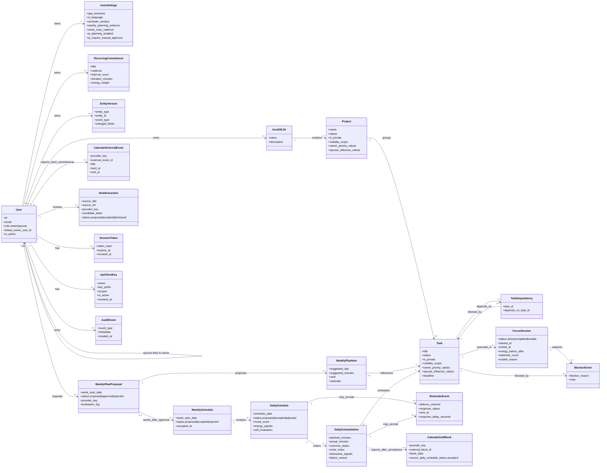

# Data and Object Models

## Purpose
This document centralizes the current Orbis persistence model and a domain-oriented object model so backend, frontend, and AI-planning work use a shared vocabulary.

## Source of truth
- Runtime models: `apps/api/app/models/*.py`
- Migration history: `apps/api/alembic/versions/*.py`
- Requirements: `docs/REQUIREMENTS.md`
- MVP scope: `docs/MVP_PLAN.md`

---

## Current implemented model (as of 2026-05-14)

The implemented model supports the MVP data requirements for users and spouse visibility, project/task management, focus signals, AI planning proposals, approved schedule execution, reminders, calendar integration, note extraction, API keys, audit events, and owner-level settings.

## Mermaid ERD (implemented tables)

```mermaid
erDiagram
    users {
      string id PK
      string email UK
      string hashed_password
      string role "owner|spouse"
      string linked_owner_user_id FK "nullable spouse-to-owner link"
      bool is_active
      datetime created_at
    }

    user_settings {
      string id PK
      string owner_user_id FK,UK
      bool reminder_enabled
      string reminder_window_start
      string reminder_window_end
      bool calendar_connected
      string calendar_provider "nullable"
      bool notes_connected
      string notes_provider "nullable"
      bool ai_planning_enabled
      bool ai_auto_generate_weekly
      bool ai_require_manual_approval
      string ai_preferred_provider "nullable"
      string app_timezone
      bool weekly_planning_enabled
      int weekly_planning_day_of_week
      string weekly_planning_time_local
      bool notes_scan_enabled
      string notes_scan_frequency
      int notes_scan_day_of_week "nullable"
      string notes_scan_time_local "nullable"
      int reminder_scan_interval_minutes
      datetime automation_pause_until "nullable"
      string ui_language
      text session_note "nullable"
      datetime created_at
      datetime updated_at
    }

    session_tokens {
      string id PK
      string user_id FK
      string token_hash UK
      datetime expires_at
      datetime revoked_at "nullable"
      datetime created_at
    }

    api_client_keys {
      string id PK
      string user_id FK
      string name
      string key_prefix
      string key_hash UK
      text scopes "nullable"
      bool is_active
      datetime last_used_at "nullable"
      datetime created_at
      datetime revoked_at "nullable"
    }

    audit_events {
      string id PK
      string actor_user_id FK "nullable"
      string event_type
      json metadata
      datetime created_at
    }

    areas_of_life {
      string id PK
      string owner_user_id FK
      string name
      text description "nullable"
      datetime created_at
      datetime updated_at
    }

    projects {
      string id PK
      string owner_user_id FK
      string area_id FK
      string name
      text description "nullable"
      string status
      bool is_private
      string visibility_scope "owner|spouse|shared"
      int priority "nullable owner value"
      int urgency "nullable owner value"
      datetime deadline "nullable owner value"
      string deadline_type "soft|hard nullable"
      int spouse_priority "nullable spouse influence"
      int spouse_urgency "nullable spouse influence"
      datetime spouse_deadline "nullable spouse influence"
      string spouse_deadline_type "soft|hard nullable"
      datetime created_at
      datetime updated_at
    }

    tasks {
      string id PK
      string owner_user_id FK
      string project_id FK "nullable"
      string title
      text notes "nullable"
      string status "staged|primed|in_flight|holding|mission_complete|scrubbed"
      bool is_private
      string visibility_scope "owner|spouse|shared"
      string priority "core|major|minor|ambient nullable owner value"
      string urgency "immediate|near|planned|flexible nullable owner value"
      datetime deadline "nullable owner value"
      string deadline_type "soft|hard nullable"
      string spouse_priority "core|major|minor|ambient nullable spouse influence"
      string spouse_urgency "immediate|near|planned|flexible nullable spouse influence"
      datetime spouse_deadline "nullable spouse influence"
      string spouse_deadline_type "soft|hard nullable"
      datetime created_at
      datetime updated_at
    }

    recurring_commitments {
      string id PK
      string owner_user_id FK
      string title
      string cadence "daily|weekly|monthly"
      int interval_count
      int duration_minutes
      float energy_weight
      datetime starts_on
      datetime ends_on "nullable"
      datetime created_at
      datetime updated_at
    }

    task_dependencies {
      string id PK
      string owner_user_id FK
      string task_id FK
      string depends_on_task_id FK
      datetime created_at
    }

    entity_versions {
      string id PK
      string owner_user_id FK
      string entity_type
      string entity_id
      string actor_user_id FK "nullable"
      string event_type
      json changed_fields
      datetime created_at
    }

    focus_sessions {
      string id PK
      string owner_user_id FK
      string task_id FK
      string status "active|completed|unable"
      datetime started_at
      datetime ended_at "nullable"
      float pre_task_energy
      float post_task_energy "nullable"
      int sidetrack_count
      text sidetrack_note "nullable"
      text unable_reason "nullable"
      datetime created_at
      datetime updated_at
    }

    blocker_events {
      string id PK
      string owner_user_id FK
      string task_id FK
      string focus_session_id FK "nullable"
      string blocker_reason
      text note "nullable"
      datetime created_at
    }

    weekly_plan_proposals {
      string id PK
      string owner_user_id FK
      date week_start_date
      string status "proposed|approved|rejected"
      string provider_key
      string prompt_template_version
      json evaluation_log
      datetime created_at
      datetime approved_at "nullable"
    }

    weekly_plan_items {
      string id PK
      string proposal_id FK
      string owner_user_id FK
      string task_id FK
      string suggested_day
      int suggested_minutes
      text rationale
      int rank
      datetime created_at
    }

    weekly_schedules {
      string id PK
      string owner_user_id FK
      date week_start_date UK
      string status "proposed|accepted|rejected"
      string source_proposal_id FK "nullable"
      datetime created_at
      datetime accepted_at "nullable"
    }

    daily_schedules {
      string id PK
      string weekly_schedule_id FK
      string owner_user_id FK
      date schedule_date
      string status "proposed|accepted|adjusted"
      int mood_score "nullable 1..5"
      float morning_energy "nullable 0..1"
      float evening_energy "nullable 0..1"
      text self_evaluation "nullable"
      datetime created_at
      datetime updated_at
    }

    daily_schedule_items {
      string id PK
      string daily_schedule_id FK
      string owner_user_id FK
      string task_id FK
      int planned_minutes
      int actual_minutes "nullable"
      string outcome_status "planned|done|postponed|failed|partial|skipped"
      int order_index
      int distraction_count
      text distraction_notes "nullable"
      date postponed_to_date "nullable"
      text failure_reason "nullable"
      datetime created_at
      datetime updated_at
    }

    reminder_events {
      string id PK
      string owner_user_id FK
      string daily_schedule_id FK "nullable"
      string daily_schedule_item_id FK "nullable"
      string delivery_channel "in_app|email|push"
      string response_status "pending|acknowledged|snoozed|dismissed"
      datetime sent_at
      datetime responded_at "nullable"
      int response_delay_seconds "nullable"
    }

    calendar_external_events {
      string id PK
      string owner_user_id FK
      string provider_key
      string external_event_id
      string title
      datetime start_at
      datetime end_at
      datetime source_updated_at
      datetime imported_at
    }

    calendar_soft_blocks {
      string id PK
      string owner_user_id FK
      string daily_schedule_id FK
      string daily_schedule_item_id FK,UK
      string provider_key
      string external_block_id
      date block_date
      string source_daily_schedule_status "accepted"
      datetime created_at
    }

    note_extractions {
      string id PK
      string owner_user_id FK
      string source_title
      string source_ref
      text note_content
      string provider_key
      json candidate_tasks
      string status "proposed|accepted|dismissed"
      datetime created_at
      datetime reviewed_at "nullable"
    }

    users ||--o{ users : links_spouse_to_owner
    users ||--|| user_settings : owns
    users ||--o{ session_tokens : authenticates
    users ||--o{ api_client_keys : authorizes
    users ||--o{ audit_events : acts_in
    users ||--o{ areas_of_life : owns
    users ||--o{ projects : owns
    users ||--o{ tasks : owns
    users ||--o{ recurring_commitments : owns
    users ||--o{ task_dependencies : owns
    users ||--o{ entity_versions : owns
    users ||--o{ focus_sessions : owns
    users ||--o{ blocker_events : owns
    users ||--o{ weekly_plan_proposals : owns
    users ||--o{ weekly_plan_items : owns
    users ||--o{ weekly_schedules : owns
    users ||--o{ daily_schedules : owns
    users ||--o{ daily_schedule_items : owns
    users ||--o{ reminder_events : receives
    users ||--o{ calendar_external_events : imports
    users ||--o{ calendar_soft_blocks : exports
    users ||--o{ note_extractions : owns

    areas_of_life ||--o{ projects : contains
    projects ||--o{ tasks : groups
    tasks ||--o{ task_dependencies : has_blockers
    tasks ||--o{ task_dependencies : is_prerequisite
    tasks ||--o{ focus_sessions : runs_in
    focus_sessions ||--o{ blocker_events : captures
    tasks ||--o{ blocker_events : blocked_by
    weekly_plan_proposals ||--o{ weekly_plan_items : contains
    tasks ||--o{ weekly_plan_items : suggested
    weekly_plan_proposals ||--o{ weekly_schedules : can_seed
    weekly_schedules ||--o{ daily_schedules : contains
    daily_schedules ||--o{ daily_schedule_items : plans
    tasks ||--o{ daily_schedule_items : scheduled_as
    daily_schedules ||--o{ reminder_events : prompts
    daily_schedule_items ||--o{ reminder_events : prompts
    daily_schedules ||--o{ calendar_soft_blocks : exports
    daily_schedule_items ||--|| calendar_soft_blocks : writes
```

---

## Mermaid object model (domain view)

This class diagram groups persistence tables into the core product objects and highlights ownership, approval, visibility, and telemetry boundaries rather than every database column.

---

## Lifecycle model

- Weekly plan proposal lifecycle: `proposed -> approved|rejected`.
- Weekly schedule lifecycle: `proposed -> accepted|rejected`.
- Daily schedule lifecycle: `proposed -> accepted -> adjusted`.
- Daily schedule item lifecycle: `planned -> done|postponed|failed|partial|skipped`.
- Note extraction lifecycle: `proposed -> accepted|dismissed`.
- Reminder response lifecycle: `pending -> acknowledged|snoozed|dismissed`.

---

## Ownership, privacy, and approval guardrails

- Owner approval gates remain mandatory before applying AI-generated planning or schedule changes.
- Private items must not leak into spouse-visible schedule, project, task, reminder, or calendar views.
- Owner priority/urgency/deadline values remain distinct from spouse influence values.
- Calendar soft blocks are written from accepted daily schedule items only; imported external events remain read-model hard commitments.
- Workers derive run decisions from persisted settings and idempotency checks; scheduled jobs create proposals or suggestions and do not bypass owner approval.
