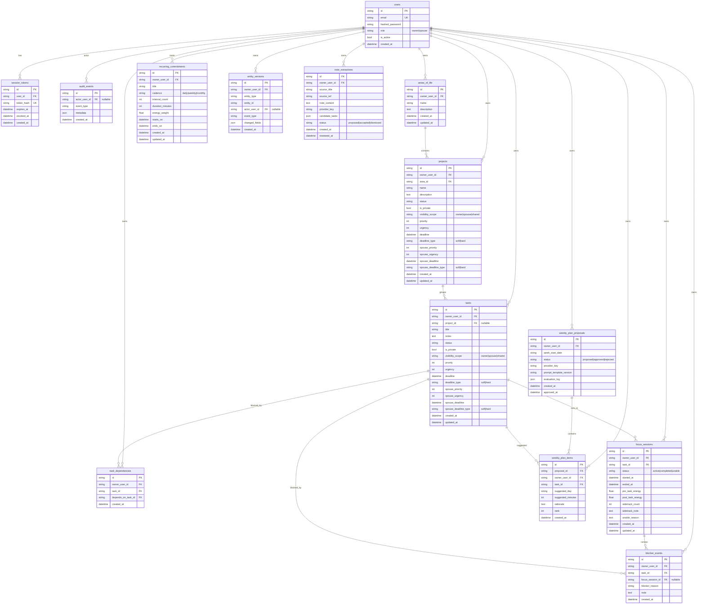
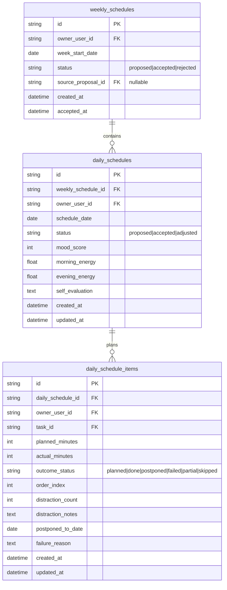

# Data Models

## Purpose
This document centralizes the current database model and the planned schedule/performance model extension so backend, frontend, and AI-planning work use a shared vocabulary.

## Source of truth
- Runtime models: `apps/api/app/models/*.py`
- Migration history: `apps/api/alembic/versions/*.py`
- Planned extension: `docs/SCHEDULE_AND_PERFORMANCE_MODEL_PLAN.md`

---

## Current implemented model (as of 2026-04-16)

## Mermaid ERD (implemented tables)

## Current behavior notes
- `weekly_plan_proposals` + `weekly_plan_items` represent AI planning artifacts, not explicit daily schedule execution records.
- Focus/blocker tables provide execution telemetry (energy/distraction/blocker signals), but daily plan acceptance/execution is not yet first-class.
- Spouse influence values are kept separate from owner values in project/task records.

---

## Planned schedule/performance extension (not yet implemented)

## Mermaid ERD (planned additions)

## Planned lifecycle model
- Weekly schedule lifecycle: `proposed -> accepted|rejected`.
- Daily schedule lifecycle: `proposed -> accepted -> adjusted`.
- Day item lifecycle: `planned -> done|postponed|failed|partial|skipped`.

## Planned implementation timing
See dated rollout in `docs/SCHEDULE_AND_PERFORMANCE_MODEL_PLAN.md` (current target window: 2026-05-04 to 2026-06-12).

---

## Ownership, privacy, and approval guardrails
- Owner approval gate remains mandatory for applying AI-generated schedule changes.
- Private items must not leak into spouse-visible schedule views.
- Owner priority fields remain distinct from spouse influence fields.

